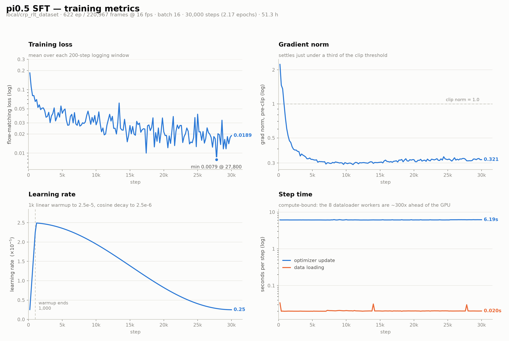
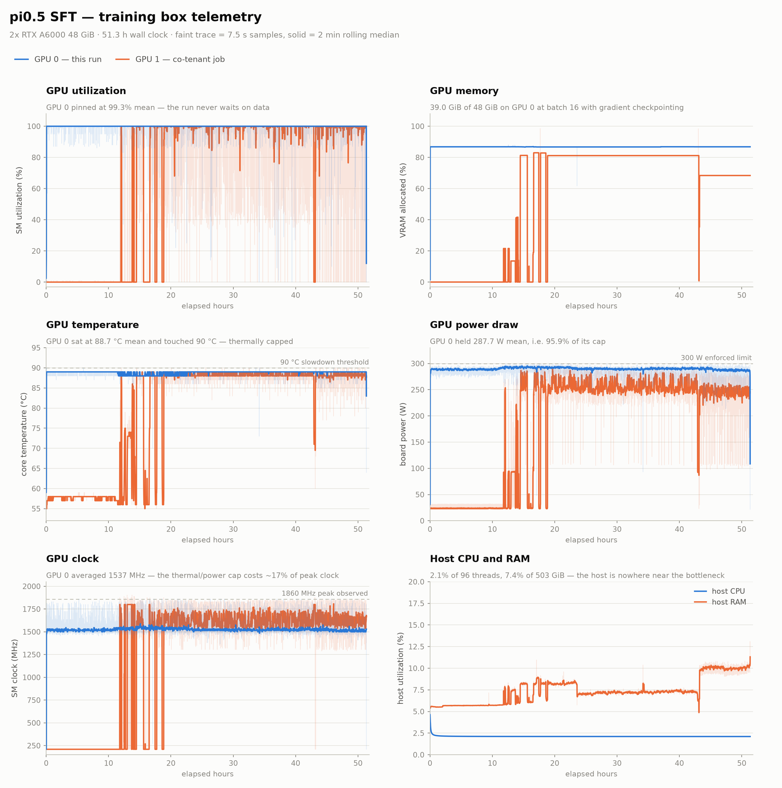

# pi0.5 SFT 训练报告 — run `biy4hbcy`

CRP 双臂 pi0.5 监督微调，30,000 steps。原始 wandb run 在训练机上离线跑的，
这里的曲线是用 `diagnostics/wandb_offline_export.py` 直接读 `.wandb` 事务日志导出的
（没有 wandb 服务器可连）。

## 训练配置

| | |
| --- | --- |
| 数据集 | `local/crp_rlt_dataset` — 622 ep / 220,967 帧 @ 16 fps / `crp_arm_dual` |
| 基座 | `pi05_base_a538eb27`（`gemma_2b` + `gemma_300m` action expert） |
| 规模 | 4.14B 参数，全参微调（视觉编码器未冻结） |
| batch / steps | 16 / 30,000（2.17 epochs） |
| 优化器 | AdamW `lr=2.5e-5`，1k 线性 warmup → cosine 衰减到 `2.5e-6`，`clip_norm=1.0` |
| chunk / n_action_steps | 50 / 50，10 步流匹配去噪 |
| 硬件 | ThinkStation P920，2× RTX A6000 48 GiB |
| 耗时 | 51.3 小时 |

## 结果



- loss `0.184 → 0.0189`，最低 `0.0079 @ 27.8k`
- 梯度范数 `2.23 → 0.32`，稳定在 clip 阈值的三分之一以下，没有发散迹象
- 数据加载不是瓶颈：6.19 s/步 vs 0.020 s，差约 300 倍



- GPU 0 利用率 99.3% 均值 —— 从没等过数据
- **GPU 0 全程 88.7 °C 均值、反复触到 90 °C 降频线**，SM 时钟均值 1537 MHz
  vs 峰值 1860 MHz，约损失 17% 时钟。下次长训前值得先清灰/调风扇曲线。
- GPU 1 从第 12 小时起有另一个任务在跑（图中标为 co-tenant），不属于本 run

两张图都有 `_dark` 版本。`summary.md` 是同样数字的表格版。

## 重新生成

```bash
conda activate crp_rlt_small && cd ~/RLT_dual

python diagnostics/wandb_offline_export.py \
  wandb/run-20260819_211931-biy4hbcy/run-biy4hbcy.wandb \
  outputs/pi05_vla_ft_report

python diagnostics/plot_train_curves.py outputs/pi05_vla_ft_report
```

`plot_train_curves.py` 需要 matplotlib + pandas；`crp_rlt_small` 里没装，可以用
`lerobot_pi05` 环境的 python 跑（只读 CSV，不碰部署环境）。

`history.csv`（150 个日志点）和 `system.csv`（24,650 个系统采样）是导出的原始数据，
一并提交以便报告自包含 —— `wandb/` 目录本身是 gitignore 的。

## 部署实测

权重本身没有入 git（8.8 GiB，单文件超 GitHub 100 MB 上限）。在部署机
（RTX 5070 Ti 16 GiB）上实测：

| 项 | 值 |
| --- | --- |
| 显存常驻 / 峰值 | 8.71 / 8.88 GiB |
| 重规划一次（整 chunk，10 步去噪） | 178 ms（预算 3.12 s） |
| chunk 内出队帧 | 1.9 ms（预算 62.5 ms） |

复现方法见 `README_crp_dual.md` 第 8 节和 `diagnostics/pi05_preflight.py`。
